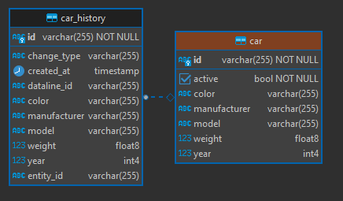

<style>
  .purple {
    color:rgb(107,79,187);
  }
</style>

# Spring Rapid REST

[](https://shields.io/)
[](https://shields.io/)

This template enables the quick creation of a service that exposes REST endpoints for CRUD
operations over data persisted in a database. The developer needs to only define the entities in
the domain and their respective [repositories](https://docs.spring.io/spring-data/data-commons/docs/1.6.1.RELEASE/reference/html/repositories.html).
The template uses [ByteBuddy](https://bytebuddy.net/) to generate the required classes for the
endpoints to function.

## Features
- Automatic creation of supporting entities (history) to track the changes on the main entities
- Automatic conversion between history and main entities
- Configured endpoints for CRUD operations and viewing of history data
- Soft deletes of main entities

## Example

You can find the required classes for an example entity *Car* in package [example/car](src/main/java/com/kmarinos/springrapidrest/example/car).
On startup some entities with dummy values are persisted to the database so that the endpoints don't return empty values (see [InitExample.java](src/main/java/com/kmarinos/springrapidrest/example/InitExample.java)).
For pre-configured examples run the [postman collection](postman_collection.json).

### The Entity [Car.java](src/main/java/com/kmarinos/springrapidrest/example/car/Car.java)

```java
public class Car extends TrackedEntity {
     
    String color;
    String model;
    String manufacturer;
    Double weight;
    Integer year;
        
}
```


### Generated tables
<p align="center"></p>

### Generated Endpoints
|                   Http Method                    | URL                                           | Description           |
|:------------------------------------------------:|-----------------------------------------------|-----------------------|
|  <span style="color:forestGreen">**GET**</span>  | http://localhost:8080/api/v1/cars             | Get All Cars          |
|  <span style="color:forestGreen">**GET**</span>  | http://localhost:8080/api/v1/car/{id}         | Get a single Car      |
|  <span style="color:forestGreen">**GET**</span>  | http://localhost:8080/api/v1/car/{id}/history | Get changes for a Car |
|  <span style="color:darkOrange">**POST**</span>  | http://localhost:8080/api/v1/car/             | Create a Car          |
| <span style="color:darkSlateBlue">**PUT**</span> | http://localhost:8080/api/v1/car/{id}         | Update a Car          |
|  <span style="color:darkRed">**DELETE**</span>   | http://localhost:8080/api/v1/car/{id}         | Delete a Car          |

$$\textcolor{yellow}{\text{Hello World}}$$
sup
{: .purple}

## How to use

### Created Entity

### Created Repository

### Generated tables

### Generated Endpoints


## Licence
[MIT](https://choosealicense.com/licenses/mit/)