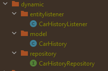

# Spring Rapid REST

[](https://shields.io/)
[](https://shields.io/)
[](https://shields.io/)

This template enables the quick creation of a service that exposes REST endpoints for CRUD
operations over data persisted in a database. The developer needs to only define the entities in
the domain and their respective [repositories](https://docs.spring.io/spring-data/data-commons/docs/1.6.1.RELEASE/reference/html/repositories.html).
The template uses [ByteBuddy](https://bytebuddy.net/) to generate the required classes for the
endpoints to function.

## Features
- Automatic creation of supporting entities (history) to track the changes on the main entities
- Automatic conversion between history and main entities
- Configured endpoints for CRUD operations and viewing of history data
- Soft deletes of main entities

## Example

You can find the required classes for an example entity *Car* in package [example/car](src/main/java/com/kmarinos/springrapidrest/example/car).
On startup some entities with dummy values are persisted to the database so that the endpoints don't return empty values (see [InitExample.java](src/main/java/com/kmarinos/springrapidrest/example/InitExample.java)).
For pre-configured examples import the [postman collection](docs/postman_collection.json) and run the tests.

### The Entity [Car.java](src/main/java/com/kmarinos/springrapidrest/example/car/Car.java)

```java
public class Car extends TrackedEntity {
     
    String color;
    String model;
    String manufacturer;
    Double weight;
    Integer year;
        
}
```


### Generated tables
<p align="center"></p>

### Generated Endpoints
|                   Http Method                    | URL                                           | Description           |
|:------------------------------------------------:|-----------------------------------------------|-----------------------|
|  <span style="color:forestGreen">**GET**</span>  | http://localhost:8080/api/v1/cars             | Get All Cars          |
|  <span style="color:forestGreen">**GET**</span>  | http://localhost:8080/api/v1/car/{id}         | Get a single Car      |
|  <span style="color:forestGreen">**GET**</span>  | http://localhost:8080/api/v1/car/{id}/history | Get changes for a Car |
|  <span style="color:darkOrange">**POST**</span>  | http://localhost:8080/api/v1/car/             | Create a Car          |
| <span style="color:darkSlateBlue">**PUT**</span> | http://localhost:8080/api/v1/car/{id}         | Update a Car          |
|  <span style="color:darkRed">**DELETE**</span>   | http://localhost:8080/api/v1/car/{id}         | Delete a Car          |


## How to use

### Create Entities
Create one class per required entity that extends [TrackedEntity](src/main/java/com/kmarinos/springrapidrest/domain/model/TrackedEntity.java) and annotate it with [@Entity](https://docs.oracle.com/javaee/7/api/javax/persistence/Entity.html). Create Accessors and Constructors as needed.

```java
@Entity
@Getter
@Setter
@AllArgsConstructor
@NoArgsConstructor
@Builder
public class Car extends TrackedEntity {

  String color;
  String model;
  String manufacturer;
  Double weight;
  Integer year;

}
```

### Create Repositories
For every entity created above, create an interface that extends JPARepository.

```java
public interface CarRepository extends JpaRepository<Car, String> {

}
```

### Register Converters
Create a class that extends [HistoryToStateConverter](src/main/java/com/kmarinos/springrapidrest/converter/HistoryToStateConverter.java) for each of your entities and register it as a Spring Bean with @Component.
Alternatively you can just extend [StandardHistoryToStateConverter](src/main/java/com/kmarinos/springrapidrest/converter/StandardHistoryToStateConverter.java) and optionally override methods on demand

```java
@Component
public class CarHistoryToStateConverter extends StandardHistoryToStateConverter<Car> {

}
```

### Register RestControllers

Create a Restcontroller (annotate with [@Restcontroller](https://docs.spring.io/spring-framework/docs/current/javadoc-api/org/springframework/web/bind/annotation/RestController.html) and optionally [@RequestMapping](https://docs.spring.io/spring-framework/docs/current/javadoc-api/org/springframework/web/bind/annotation/RequestMapping.html)) that extends
[AbstractEntityController](src/main/java/com/kmarinos/springrapidrest/controller/AbstractEntityController.java). Alternatively you can just extend [StandardEntityController](src/main/java/com/kmarinos/springrapidrest/controller/StandardEntityController.java) and override methods on demand.
```java
@RestController
@RequestMapping("api/v1")
public class CarRestController extends StandardEntityController<Car> {

}
```

### Package the application
For the classes to be generated, the spring context needs to be loaded once while packaging. The simplest way to achieve this is to run:
```bash
mvn clean package
```
You can find the generated classes under *./target/classes/com/kmarinos/springrapidrest/domain/dynamic*.
<p align="center"></p>

### Run the application
Run the application with maven
```bash
mvn spring-boot:run 
```

### Generated tables
For every table that is generated with Hibernate, an accompanying one is generated with the prefix _history.
It has all the fields that the main entity has in addition to:
* **datalineId** (To track of changes made during the same process/batch/context)
* **createdAt** (Date and time of change)
* **changeType** (can be of type CREATE, UPDATE, DELETE)

Any foreign keys are also documented in the history entity. However, the foreign key relationship
between history and foreign main entities is severed, since it only represents the association at a specific point in time,
and it is not meant to be changed.

### Generated Endpoints
There are 6 endpoints that are generated for each entity. The URL is generated automatically from the class name.
To override this functionality annotate the RestController with [@EntityRootPath](src/main/java/com/kmarinos/springrapidrest/config/EntityRootPath.java). The following REST endpoints are created:
* Get all Entities
* Get a single Entity
* Get all changes for an Entity
* Create an Entity
* Update an Entity
* Delete an Entity


## Licence
[MIT](https://choosealicense.com/licenses/mit/)